#Drone Searching

## Introduction
#### Problem Statement
* To quickly search in a x by x area for an object of interest using a drone
* Drone is situated at a start location
* The last seen location of the object of interest is given (this object may move around in the sky)
* Search area is also given 
    * avoid obstacles/buildings
    * cover the entire area 
(with little overlap of covered areas)

#### Solution Overview
* Drone flies form start location to edge of field
* Then it spirals inwards towards the last seen location of the object of interest
*  As the same time, the drone's camera covers the area on the ground
*  If there are building/obstacles at any point of the path, it will avoid them

 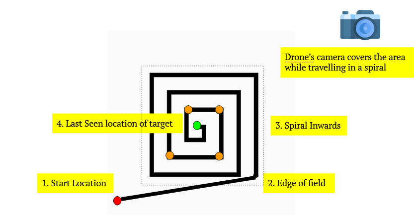

## Solution Part 1: Setting Spiral Corners
* The horizontal/vertical increment of the spiral is based on the area of camera footprint at each vertice 
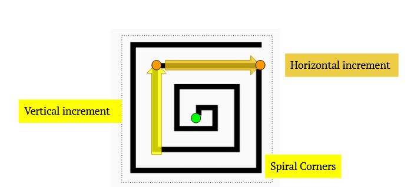
* To ensure that there is little overlap in the footprint,  the footprint is calculated based on
    * Altitude
    * Yaw/Pitch Angle
    * Size of x sensor/y sensor
    * Focal Length
    
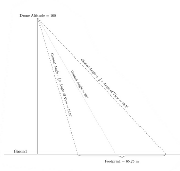

## Solution Part 2: Avoid Obstacles
* There might be obstacles on the path between one spiral corner and the next
* 3D pathfinding to find the path
* 3D Pathfinding: *Lazy Theta**
* Adapted from another interns project
* Unity3D project
* 3D Pathfinding whilst avoiding obstacle

* *Lazy Theta** finds a path with Octree and Graph 
* The Octree is build from a mesh of each obstacle
* Hence, all shapefile polygons needs to be converted to 3D Mesh
* The Graph is build by adding arcs to the Octree
* Octree + Graph = World object

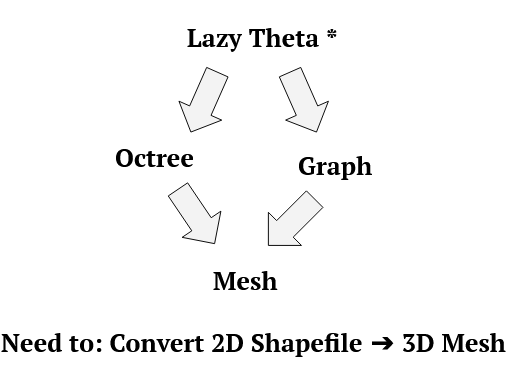

> **Build Mesh**
> 1. Each shapefile polygon → Read as a feature
> 2. Delaunay triangulation is called on each feature
> 
> 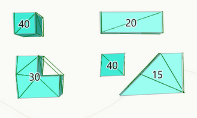
> 
> 3. All vertices are extruded to 3D
> 
> 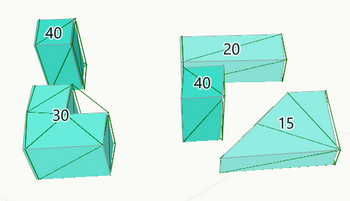
> 
> 4. Normals are calculated based on the normal of each triangle
Triangle Vertices + Normals = Mesh
>
>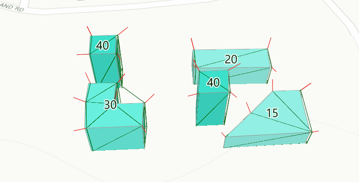

* *Lazy Theta** is run to obtain 3D path from point to point
* When an obstacle is encountered, it can:
  * Go around it
  * Go above it
 * Of the 2 options, the one that gives a shorter distance is choosen

1. Going above building
    * Short (10 - 20m) OR large area
    * Buffer between drone & top of building

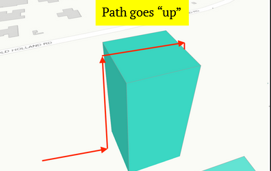

2. Going around building
    * Tall (> 30m) OR small area
    * Buffer between drone & side of building
    
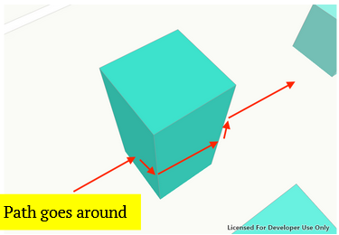

## Setup Instructions
1. Fork repository
2. Clone source code on local computer
3. Go to DvD_Dev.sln and open with Visual Studio Code 2019
4. In the top bar of Visual Studio Code, set:
    * Solution Configuration: Debug
    * Solution Platforms: x86
5. Run application by clicking <kbd>Local Machine</kbd>

### Possible Setup Errors
 * **Error**: \{Library\} requires >= 10 Version of Windows SDK
    
    **Solution**: Download the required Windows SDK Version online. Under Solution > Properties, change target platform version to required version
 * **Error**: The type or namespace '\{Project Name}\}" could not be found
    
    **Solution**: DvD_Dev project > References > Projects > Tick the \{Project Name\} row
* **Error**: HRESULT_EFAIL error when using file picker / folder picker
    
    **Solution**: Close all files (that you are going to pick in the file picker)

* **Error**: Spatial Reference is null
    
    **Solution**: Delete all temp files under applicaiton folder
                        
 

## App Use
1. Import shapefile
    * Represent obstacles
    * Obstacle height = HEIGHT attr.
    
   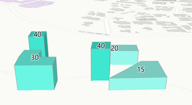

2. Double click to generate mesh
   * Mesh is used to create octree & graph
   * Octree & graph is centred at clicked point
   
   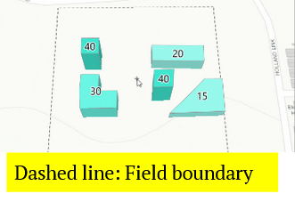

3. Initialise start & last seen location
4. Program generates deconflicted spiral path
    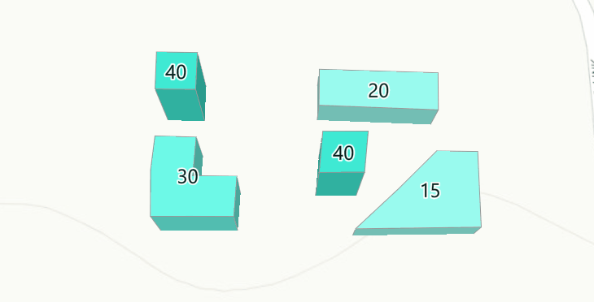

5. Drone coverage is output in the console as a percentage of total area (excl. area occupied by buildings)

5. Export path waypoints as file (KML File)
6. Import file into drone controller app (DJI Pilot) as mission
7. Execute drone mission 
8. Drone executes the path autonomously (DJI Phantom 3)

 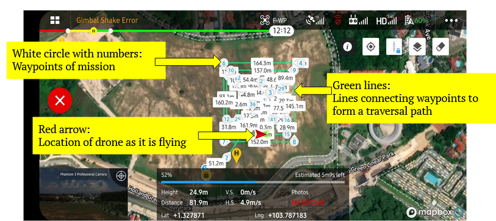
       
       The DJI Pilot Interface when a drone mission is executing

### Additional Features
* Building octree: O(n)
* Building graph: O(n)
* Large shapefiles = significantly long runtime ✘
* Do it only once ✔

1. Serialize World object

    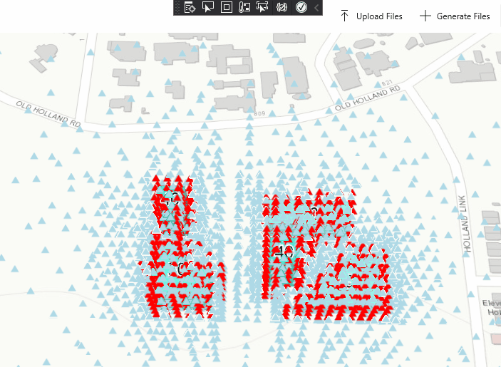

2. Deserialize World object

    

### Visualisation Modes
* Octree Display
    * Light Blue Triangles: Unblocked node
    * Red Triangle: Blocked node (Similar to the outline of the obstacle)
    

* Graph Display
    * Green Triangles: Unblocked node
    * Green Lines: Graph arc
    * Red Triangle: Blocked node (Similar to the outline of the obstacle)
    

* Camera footprint
    * Yellow Highlight: Region of camera footprint
    
    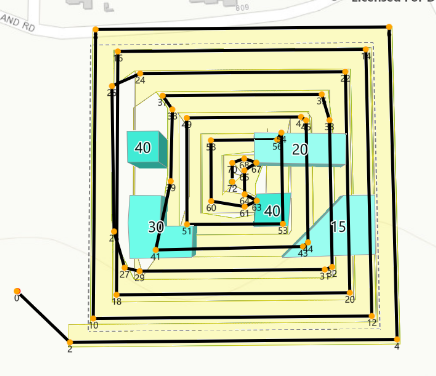

* Mesh + Mesh Normals
    * Green Lines: Mesh Lines
    * Red Lines: Normals of each vertice
    

## Next Steps
* Each turn in spiral corner is a sharp 90°
    * Implement support for for a smoother radial turn
* Drone path exported as KML files to be run on DJI Phantom 3
  * Support exporting drone path as other file formats
  * For other drone models
* Current algorithm searches a space in spiral
  * Implement a faster search algorithm

